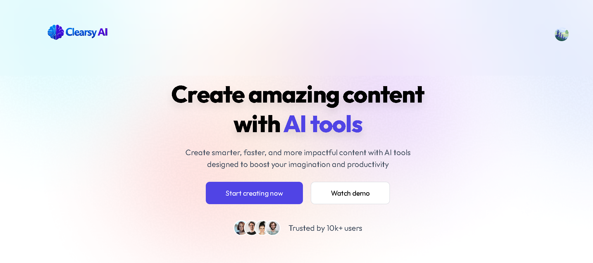
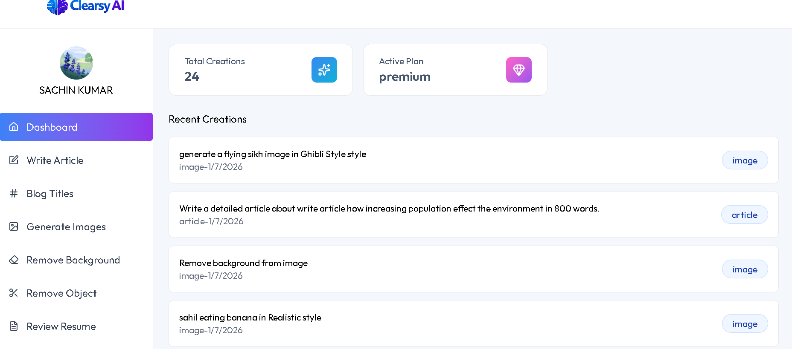
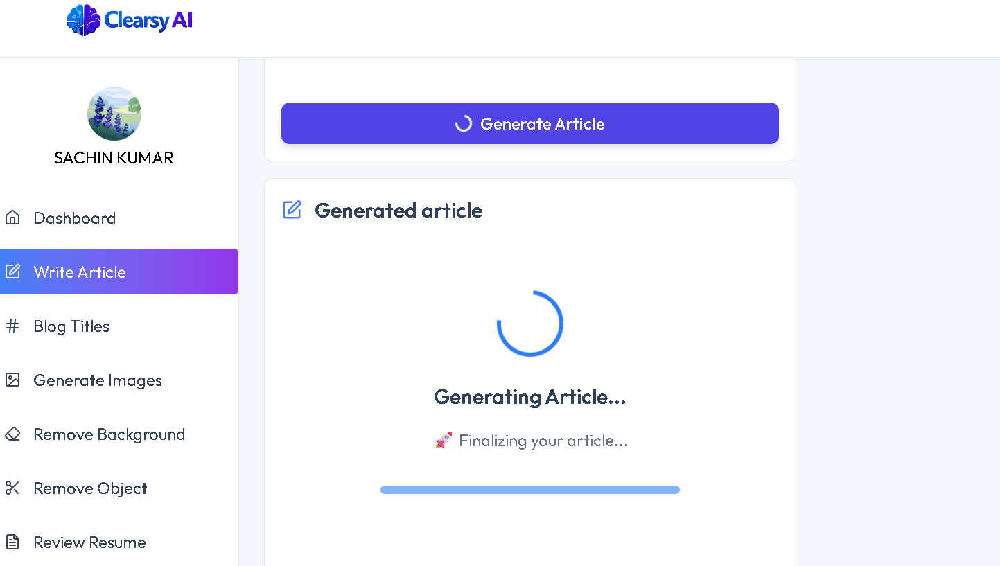
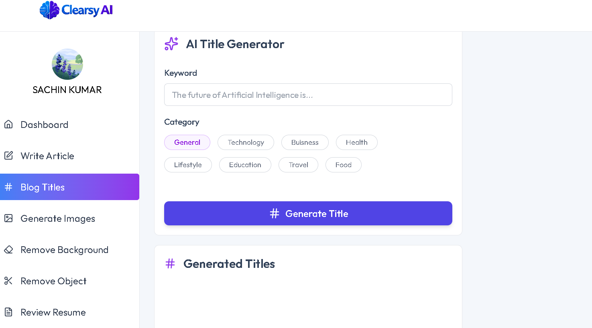
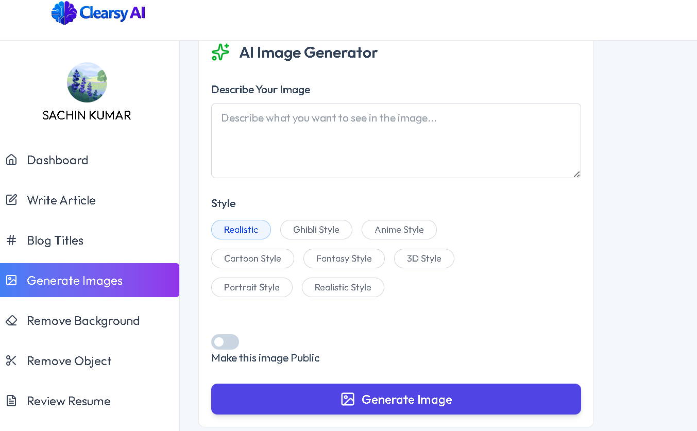

<div align="center">

# 🚀 Clearsy AI

### AI-Powered SaaS Platform for Content Creation & Image Processing

Generate articles, blog titles, AI images, review resumes, remove backgrounds, and edit images — all from one modern AI platform.

<p>


</p>

</div>

---

# 📖 Overview

Clearsy AI is a full-stack AI SaaS application built using **React**, **Node.js**, **Express**, **Neon PostgreSQL**, **Google Gemini**, **Cloudinary**, and **Clerk Authentication**.

It enables users to generate high-quality AI content, create images, review resumes, remove image backgrounds, and manage their AI creations from one dashboard.

---

# ✨ Features

## 🤖 AI Writing

- AI Article Generator
- AI Blog Title Generator
- Markdown Support
- Multiple Article Length Options

---

## 🎨 AI Image Tools

- AI Image Generator
- Remove Image Background
- Remove Objects from Images
- Cloudinary Image Storage

---

## 📄 Resume Tools

- AI Resume Review
- PDF Upload Support
- Resume Analysis & Suggestions

---

## 👤 Authentication

- Clerk Authentication
- Google Login
- Protected Routes
- Premium User Support

---

## 📊 Dashboard

- User Dashboard
- AI Creation History
- Active Plan Display
- Community Page

---

# 🛠️ Tech Stack

## Frontend

- React
- Vite
- Tailwind CSS
- Axios
- React Router DOM
- React Markdown
- Clerk
- Lucide Icons
- React Hot Toast

---

## Backend

- Node.js
- Express.js
- Neon PostgreSQL
- Gemini API
- Cloudinary
- Multer
- Clerk Backend SDK

---

## Database

- Neon PostgreSQL

---

## AI Services

- Google Gemini API
- ClipDrop API

---

# 📂 Project Structure

```text
Clearsy-AI/

│

├── Frontend/

│ ├── src/

│ ├── public/

│ ├── package.json

│ └── ...

│

├── Backend/

│ ├── src/

│ ├── server.js

│ ├── package.json

│ └── ...

│

├── screenshots/

│

├── README.md

└── .gitignore
```

---

# 📸 Screenshots

## 🏠 Home Page

```
screenshots/home.png
```



---

## 📊 Dashboard

```
screenshots/dashboard.png
```



---

## ✍️ Article Generator

```
screenshots/article-generator.png
```



---

## 📰 Blog Title Generator

```
screenshots/blog-title.png
```



---

## 🎨 Image Generator

```
screenshots/image-generator.png
```



---

## 📄 Resume Review

```
screenshots/resume-review.png
```


---

# ⚙️ Installation

## Clone Repository

```bash
git clone https://github.com/YOUR_USERNAME/Clearsy-AI.git

cd Clearsy-AI
```

---

## Install Frontend

```bash
cd Frontend

npm install

npm run dev
```

---

## Install Backend

```bash
cd Backend

npm install

npm start
```

---

# 🔑 Environment Variables

## Backend (.env)

```env
DATABASE_URL=

CLERK_SECRET_KEY=

CLERK_PUBLISHABLE_KEY=

GEMINI_API_KEY=

CLIPDROP_API_KEY=

CLOUDINARY_CLOUD_NAME=

CLOUDINARY_API_KEY=

CLOUDINARY_API_SECRET=
```

---

## Frontend (.env)

```env
VITE_BASE_URL=

VITE_CLERK_PUBLISHABLE_KEY=
```

---

# 🏗️ Architecture

```
                React + Vite
                     │
                     │
              Express REST API
                     │
      ┌──────────────┼──────────────┐
      │              │              │
  Gemini API     PostgreSQL     Cloudinary
      │            (Neon)          │
      │              │             │
      └──────────────┼─────────────┘
                     │
                 Clerk Auth
```

---

# 🚀 Future Improvements

- AI Chat Assistant
- AI Content Rewriter
- Team Collaboration
- Payment Integration (Stripe)
- Usage Analytics
- AI Content Templates
- Multi-language Support

---

# 📈 Performance

✅ Responsive Design

✅ Protected Routes

✅ Optimized API Calls

✅ Reusable Components

✅ Loading UX

✅ Markdown Rendering

✅ Cloud Image Storage

---

# 🤝 Contributing

Contributions are welcome.

1. Fork the repository

2. Create a new branch

3. Commit your changes

4. Push your branch

5. Create a Pull Request

---

# 👨‍💻 Author

## Sachin Kumar

B.Tech CSE | Full Stack Developer | AI Enthusiast

GitHub

https://github.com/YOUR_USERNAME

LinkedIn

https://linkedin.com/in/YOUR_LINKEDIN

Portfolio

https://YOUR_PORTFOLIO

---

<div align="center">

### ⭐ If you like this project, don't forget to Star the repository ⭐

Made with ❤️ using React, Node.js, Express & AI

</div>
